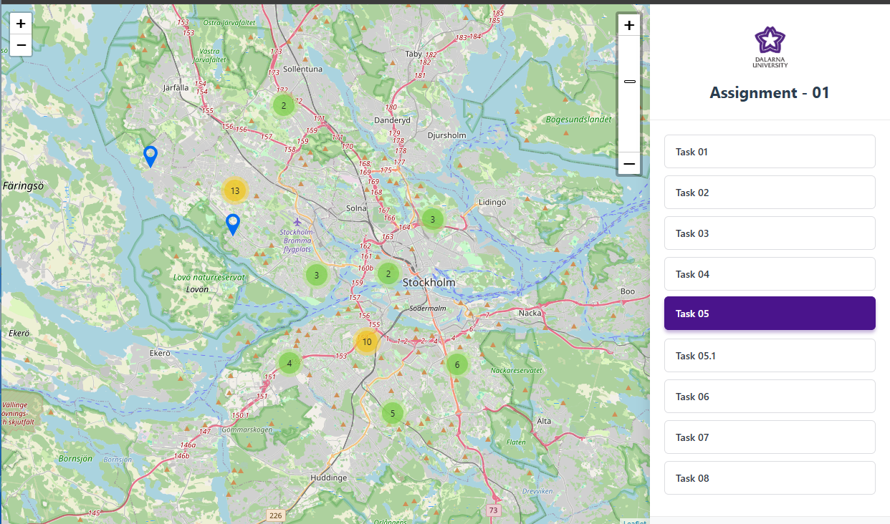
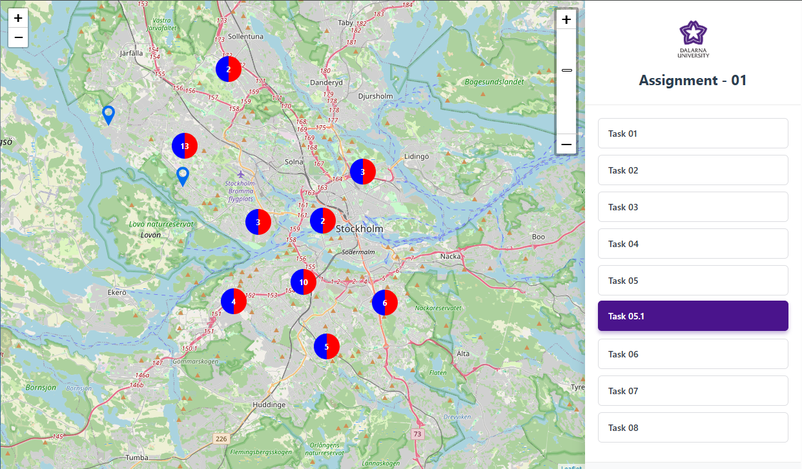

# Web Mapping GIS Application

A Flask-based GIS web application developed using Leaflet.js, Turf.js, and OpenWeatherMap API.

## Screenshots




## Features

- Interactive web map
- Point, line, and polygon visualization
- Buffer analysis
- Weather API integration
- K-Means clustering
- Marker clustering
- Raster image overlay
- Spatial analysis using Turf.js

## Technologies Used

- Flask
- Leaflet.js
- JavaScript
- Turf.js
- OpenWeatherMap API
- HTML/CSS
- Bootstrap

## Tasks Included

1. Basic GIS features
2. Interactive location information
3. Buffer overlap analysis
4. Image overlay
5. Marker clustering
6. Weather API integration
7. K-Means clustering
8. Spatial accessibility analysis

Author
Nadiranga Lakruwan

## Installation

```bash
pip install -r requirements.txt
python app.py
